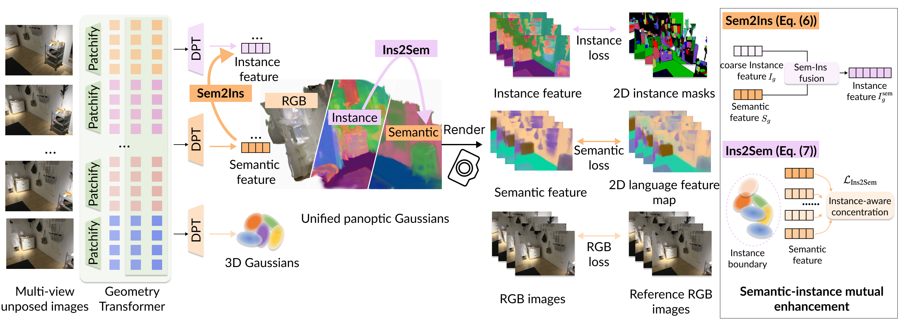
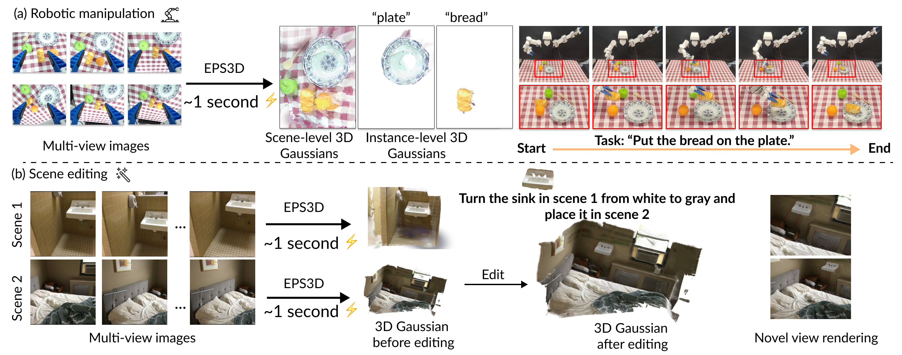

# EPS3D: End-to-End Feed-Forward 3D Panoptic Segmentation

<p align="center">
  
</p>

<p align="center">
  
</p>

This is the official PyTorch implementation of the following publication:

> **EPS3D: End-to-End Feed-Forward 3D Panoptic Segmentation**<br/>
> Runsong Zhu, Jiaxin Guo, Xiaoyang Guo&dagger;, Zhengzhe Liu&dagger;, Ka-Hei Hui, Wei Yin, Kai Chen, Wei Chen, Weiqiang Ren, Yunhui Liu, Pheng-Ann Heng, Chi-Wing Fu.<br/>
> *ICML 2026*<br/>

## Requirements

- Python 3.10+
- PyTorch 2.3.1 + CUDA 11.8
- Required checkpoints in `../checkpoints/EPS3D/`
- CLIP checkpoint: `../checkpoints/ViT-B-32.pt`
- Test data: `../data/scannet_test/`

Install dependencies:

```bash
pip install -r requirements.txt
```

## Quick Start on ScanNet Dataset

### Download Dataset & Pre-trained Models

The following model weights and data need to be downloaded and placed following the above directory structure:

| File | Link |
|------|------|
| EPS3D checkpoint | [Download](https://mycuhk-my.sharepoint.com/:u:/g/personal/1155183723_link_cuhk_edu_hk/IQCZoGR0XNt5R4PNuemtQ26wATLIq7TUEzVi8kozb1EZ9IY?e=hMgEeA) |
| CLIP weight (ViT-B-32.pt) | [Download](https://mycuhk-my.sharepoint.com/:u:/g/personal/1155183723_link_cuhk_edu_hk/IQCh2jfohxBXSZ0ALeW6NabJAcZfCoRU_Ka_foo4GATnuoU?e=L2UsTT) |
| ScanNet test data | [Download](https://mycuhk-my.sharepoint.com/:u:/g/personal/1155183723_link_cuhk_edu_hk/IQDEil6a9efPTbIV9pmJkxrAAVJ17N9MFo587YdweeD3xnQ?e=HdX2w3) |

**Note:** The provided checkpoint differs slightly from the original implementation details in paper: we freeze the appearance gaussian head weights from [AnySplat](https://github.com/InternRobotics/AnySplat) and retrain only the perception-related modules, which achieves comparable performance on ScanNet with lower memory cost.

### Directory Structure

```
EPS3D/
├── code_eps3d/
│   ├── src/                          # Core model code
│   │   └── model/
│   │       ├── model/
│   │       │   ├── eps3d.py          # EPS3D base model
│   │       │   └── eps3d_panoptic.py # EPS3D panoptic model
│   │       ├── encoder/              # VGGT encoder + Gaussian adapter
│   │       └── decoder/              # CUDA splatting decoder
│   ├── scripts/
│   │   ├── run_eps3d_scannet.sh      # ScanNet 8-view evaluation
│   │   ├── run_eps3d_scannet_2view.sh # ScanNet 2-view evaluation
│   │   ├── test_eps3d_panoptic.py    # Main evaluation script
│   │   ├── evaluate_pq.py           # PQ metric evaluation
│   │   └── data_utils/              # Data loading utilities
│   ├── submodules/                   # Dependencies (dust3r, VGGT, etc.)
│   ├── config/                       # Model configurations
│   └── lseg.py                       # LSeg feature extractor
├── data/
│   └── scannet_test/                 # ScanNet test scenes
├── checkpoints/
│   ├── EPS3D/
│   │   ├── model.safetensors        # EPS3D model weights
│   │   ├── config.json              # EPS3D model config
│   │   └── demo_e200.ckpt           # LSeg model
│   └── ViT-B-32.pt                  # CLIP weights
```

### Setup

```bash
# 1. Create directories
mkdir -p checkpoints/ data/

# 2. Place the downloaded EPS3D checkpoint
mv path/to/EPS3D checkpoints/

# 3. Place the CLIP ViT-B-32 weights
mv path/to/ViT-B-32.pt checkpoints/

# 4. Download the LSeg demo model weights
gdown 1FTuHY1xPUkM-5gaDtMfgCl3D0gR89WV7 -O checkpoints/demo_e200.ckpt

# 5. Place the ScanNet test data
mv path/to/scannet_test data/
```

### ScanNet 8-view Evaluation

```bash
cd scripts

# Novel-view (default)
bash run_eps3d_scannet.sh

# Context-view
bash run_eps3d_scannet.sh context
```

### ScanNet 2-view Evaluation

```bash
cd scripts

# Novel-view (default)
bash run_eps3d_scannet_2view.sh

# Context-view
bash run_eps3d_scannet_2view.sh context
```

## Citation

```
TBD
```

## Acknowledgement

This work is built on many great research works and open-source projects, thanks a lot to all the authors for sharing!

- [VGGT](https://github.com/facebookresearch/vggt)
- [AnySplat](https://github.com/InternRobotics/AnySplat)
- [Uni3R](https://github.com/HorizonRobotics/Uni3R)
- [LSM](https://github.com/NVlabs/LSM)
- [Gaussian-Splatting](https://github.com/graphdeco-inria/gaussian-splatting) and [diff-gaussian-rasterization](https://github.com/graphdeco-inria/diff-gaussian-rasterization)
- [DUSt3R](https://github.com/naver/dust3r)
- [Language-Driven Semantic Segmentation (LSeg)](https://github.com/isl-org/lang-seg)

